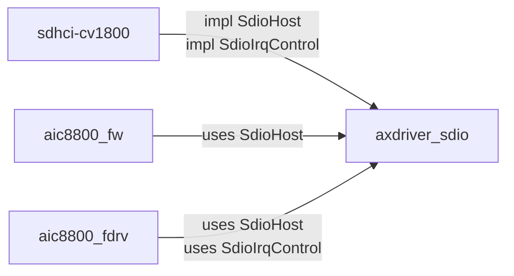

# axdriver_sdio  

SDIO 主机控制器 trait 抽象层，为 [ArceOS](https://github.com/arceos-org/arceos) / [StarryOS](https://github.com/Ticonderoga2017/StarryOS) 无线子系统提供与硬件无关的 SDIO 总线接口。  

> 命名遵循 ArceOS `axdriver_*` 系列 crate 规范（`axdriver_net`、`axdriver_block`、`axdriver_display` 等），  
> 本 crate 为纯协议抽象层。  

## 设计定位  

```  
┌─────────────────────────────────────────────────┐  
│              应用 / OS 模块层                     │  
│         (axnet, axruntime, src/main.rs)          │  
├─────────────────────────────────────────────────┤  
│           WiFi 驱动层 (wireless/)                │  
│   aic8800_fw    aic8800_fdrv    aic8800_net      │  
├─────────────────────────────────────────────────┤  
│         ★ axdriver_sdio (本 crate) ★             │  
│      SdioHost trait  ·  SdioIrqControl trait     │  
├─────────────────────────────────────────────────┤  
│           平台硬件驱动 (wireless/)                │  
│              sdhci-cv1800 (SG2002)               │  
└─────────────────────────────────────────────────┘  
```

本 crate 是 wireless 模块的**最底层抽象**，定义了 SDIO 总线操作的统一接口。  
上层驱动（`aic8800_fw`、`aic8800_fdrv`）通过泛型 `<H: SdioHost>` 使用此接口，  
下层平台驱动（`sdhci-cv1800`）为具体硬件实现此接口。  

## 特性  

- **`#![no_std]`** — 纯裸机环境，无标准库依赖  
- **零外部依赖** — 不依赖任何第三方 crate，不依赖 `alloc`  
- **硬件无关** — 仅定义 SDIO 协议级抽象，不包含任何具体芯片或 SoC 的代码  
- **设备无关** — 不包含 AIC8800 等 WiFi 芯片的寄存器定义（这些属于驱动层）  
- **ISR 安全** — `SdioIrqControl` trait 与 `SdioHost` 分离，专为中断上下文设计  
  
## 模块结构  

```  
axdriver_sdio/  
├── Cargo.toml  
├── README.md  
└── src/  
    ├── lib.rs       # SdioHost trait 定义 + 模块声明  
    ├── error.rs     # SdioError 错误类型  
    ├── irq.rs       # SdioIrqControl trait（ISR 安全的中断控制）  
    ├── cccr.rs      # CCCR / FBR / CIS 协议常量  
    └── cmd.rs       # SD 命令号 / OCR / R5 / CMD52 / CMD53 常量  
```

## 核心 API  

### `SdioHost` trait — 数据传输接口  

SDIO 主机控制器的核心抽象，覆盖 SDIO 卡的完整生命周期：  

```rust  
pub trait SdioHost: Send + Sync {  
    /// 初始化控制器，执行 SDIO 卡枚举 (CMD5 → CMD3 → CMD7)  
    fn init(&mut self) -> Result<(), SdioError>;  
  
    /// CMD52: 单字节读 (I/O Read Direct)  
    fn read_byte(&self, func: u8, addr: u32) -> Result<u8, SdioError>;  
  
    /// CMD52: 单字节写 (I/O Write Direct)  
    fn write_byte(&self, func: u8, addr: u32, val: u8) -> Result<(), SdioError>;  
  
    /// CMD53: 多字节/块读 (I/O Read Extended, fixed address / FIFO)  
    fn read_fifo(&self, func: u8, addr: u32, buf: &mut [u8]) -> Result<(), SdioError>;  
  
    /// CMD53: 多字节/块写 (I/O Write Extended, fixed address / FIFO)  
    fn write_fifo(&self, func: u8, addr: u32, buf: &[u8]) -> Result<(), SdioError>;  
  
    /// 设置指定 function 的 block size  
    fn set_block_size(&self, func: u8, size: u16) -> Result<(), SdioError>;  
  
    /// 设置 SDIO 时钟频率 (Hz)，默认空实现  
    fn set_clock(&self, hz: u32) -> Result<(), SdioError> { Ok(()) }  
  
    /// 使能指定 SDIO function (1-7)  
    fn enable_func(&self, func: u8) -> Result<(), SdioError>;  
  
    /// 获取 SDIO 卡的 vendor/device ID  
    fn vendor_device_id(&self) -> (u16, u16);  
}  
```

### `SdioIrqControl` trait — 中断控制接口  

从 `SdioHost` 分离的中断控制抽象。分离原因：ISR（中断服务程序）中无法持锁获取  
`SdioHost` 实例，需要通过裸 MMIO 地址操作中断寄存器。  

```rust  
pub trait SdioIrqControl: Send + Sync {  
    /// 获取 MMIO 基地址（ISR 中用于裸地址操作）  
    fn mmio_base(&self) -> usize;  
  
    /// 屏蔽/恢复 CARD_INT 信号  
    /// mask=true: 屏蔽（防止电平触发重复进入 ISR）  
    /// mask=false: 恢复（RX 处理完毕后重新使能）  
    fn mask_card_irq(&self, mask: bool);  
  
    /// 使能 CARD_INT 中断信号  
    fn enable_card_irq(&self);  
  
    /// 禁用所有中断信号  
    fn disable_all_irq(&self);  
}  
```

**约束**：实现者必须保证所有方法可在中断上下文中安全调用 — 不持锁、不分配堆、不调度。  

### `SdioError` — 错误类型  

```rust  
#[derive(Debug, Clone, Copy, PartialEq, Eq)]  
pub enum SdioError {  
    Timeout,      // 命令或数据传输超时  
    CrcError,     // CRC 校验失败           
    DataError,    // 数据传输错误      
    NoCard,  	  // 卡未检测到 
    Unsupported,  // 不支持的操作  
    IoError,      // 通用 I/O 错误  
}  
```

## 协议常量  

### `cccr` 模块 — CCCR / FBR 寄存器地址  

[CCCR (Card Common Control Registers)](https://www.sdcard.org/) 是 SDIO 卡 Function 0  
地址空间中的标准寄存器，用于卡的配置和状态查询。  

| 常量                    | 地址 | 说明                                          |
| ----------------------- | ---- | --------------------------------------------- |
| `CCCR_IO_ENABLE`        | 0x02 | I/O Function 使能（每 bit 对应一个 function） |
| `CCCR_IO_READY`         | 0x03 | I/O Function 就绪状态（read-only）            |
| `CCCR_BUS_INTERFACE`    | 0x07 | 总线宽度设置（1-bit / 4-bit）                 |
| `CCCR_BUS_SPEED_SELECT` | 0x13 | 高速模式 / UHS 速度选择                       |
| `CCCR_CIS_POINTER`      | 0x09 | CIS 指针（3 bytes）                           |

FBR (Function Basic Registers) 通过 `fbr_base(func)` 计算基地址：  

```rust  
// Function 1 的 block size 寄存器地址  
let addr = cccr::fbr_base(1) + cccr::FBR_BLOCK_SIZE_OFFSET;  
// addr = 0x100 + 0x10 = 0x110  
```

### `cmd` 模块 — SD 命令和响应  

| 常量                   | 值     | 说明                  |
| ---------------------- | ------ | --------------------- |
| `CMD5_IO_SEND_OP_COND` | 5      | SDIO 卡操作条件查询   |
| `CMD52_IO_RW_DIRECT`   | 52     | 单字节 I/O 读写       |
| `CMD53_IO_RW_EXTENDED` | 53     | 多字节/块 I/O 读写    |
| `OCR_IORDY`            | bit 31 | 卡就绪标志            |
| `R5_ERROR_MASK`        | —      | R5 响应错误位聚合掩码 |
| `CMD53_BLOCK_MODE`     | bit 27 | CMD53 块传输模式标志  |

> **注意**：SDHCI 控制器寄存器位（Transfer Mode、Present State 等）不在本 crate 中，  
> 它们属于 SDHCI 实现层（`sdhci-cv1800/src/regs.rs`）。  

## 使用示例  

### 实现 `SdioHost`（平台驱动侧）  

```rust  
// wireless/sdhci-cv1800/src/lib.rs  
use axdriver_sdio::{SdioHost, irq::SdioIrqControl, error::SdioError};  
  
pub struct CviSdhci { base: usize, /* ... */ }  
  
impl SdioHost for CviSdhci {  
    fn init(&mut self) -> Result<(), SdioError> {  
        // CMD5 → CMD3 → CMD7 → 4-bit mode  
        todo!()  
    }  
    fn read_byte(&self, func: u8, addr: u32) -> Result<u8, SdioError> {  
        // 构造 CMD52 参数，发送命令，解析 R5 响应  
        todo!()  
    }  
    // ... 其余方法  
    fn vendor_device_id(&self) -> (u16, u16) { (0x5449, 0x0145) }  
}  
  
impl SdioIrqControl for CviSdhci {  
    fn mmio_base(&self) -> usize { self.base }  
    fn mask_card_irq(&self, mask: bool) { /* MMIO 操作 */ }  
    fn enable_card_irq(&self) { /* 写 NORM_INT_SIG_EN */ }  
    fn disable_all_irq(&self) { /* 清零 NORM_INT_SIG_EN */ }  
}  
```

### 使用 `SdioHost`（驱动侧）  

```rust  
// wireless/aic8800_fdrv/src/bus.rs  
use axdriver_sdio::{SdioHost, irq::SdioIrqControl};  
  
pub struct WifiBus<H: SdioHost + SdioIrqControl> {  
    sdio: Arc<Mutex<H>>,  
    // ...  
}  
  
impl<H: SdioHost + SdioIrqControl + 'static> WifiBus<H> {  
    pub fn read_flow_ctrl(&self) -> Result<u8, SdioError> {  
        let sdio = self.sdio.lock();  
        sdio.read_byte(1, 0x0A)  // SDIOWIFI_FLOW_CTRL_REG  
    }  
}  
```

## 依赖关系  



本 crate 是依赖图的**叶节点**，不依赖任何其他 wireless crate。  

## 与 ArceOS axdriver_* 系列的关系  

| ArceOS crate        | 抽象对象                   | 本 crate 对应 |
| ------------------- | -------------------------- | ------------- |
| `axdriver_base`     | 所有设备的基础 trait       | —             |
| `axdriver_net`      | 网络设备 (`NetDriverOps`)  | —             |
| `axdriver_block`    | 块设备 (`BlockDriverOps`)  | —             |
| **`axdriver_sdio`** | **SDIO 总线** (`SdioHost`) | **本 crate**  |

`axdriver_sdio` 与 `axdriver_net` 是**不同层次**的抽象：  
- `axdriver_sdio` 抽象的是**总线**（SDIO 传输通道）  
- `axdriver_net` 抽象的是**设备功能**（网络收发）  
- WiFi 芯片通过 SDIO 总线连接，但对外表现为网络设备  
- 桥接层 `aic8800_net` 负责将 `SdioHost` 上的 WiFi 驱动包装为 `NetDriverOps`  
  
## SDIO 协议参考  

- [SD Specifications Part E1 — SDIO Simplified Specification v3.00](https://www.sdcard.org/downloads/pls/)  
- [SD Host Controller Simplified Specification v3.00](https://www.sdcard.org/downloads/pls/)  
  
### SDIO 命令流程  

```  
Host                          Card  
  │                             │  
  │──── CMD5 (OCR query) ──────>│  
  │<─── R4 (OCR + ready) ──────│  
  │                             │  
  │──── CMD3 (get RCA) ────────>│  
  │<─── R6 (RCA) ──────────────│  
  │                             │  
  │──── CMD7 (select card) ────>│  
  │<─── R1b ───────────────────│  
  │                             │  
  │──── CMD52 (CCCR r/w) ─────>│  ← 单字节 I/O  
  │<─── R5 ────────────────────│  
  │                             │  
  │──── CMD53 (FIFO r/w) ─────>│  ← 多字节/块 I/O  
  │<─── R5 + data ─────────────│  
```

## License  

与 StarryOS 主项目一致。